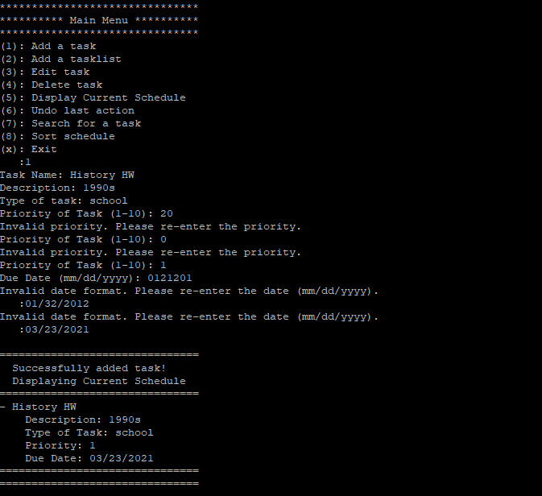
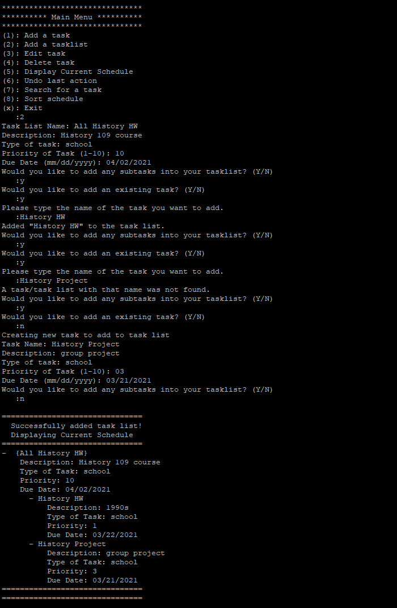
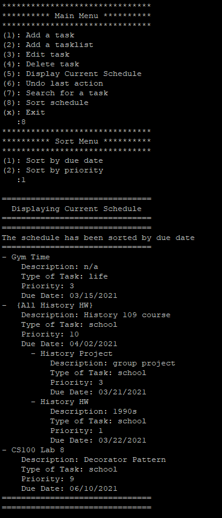
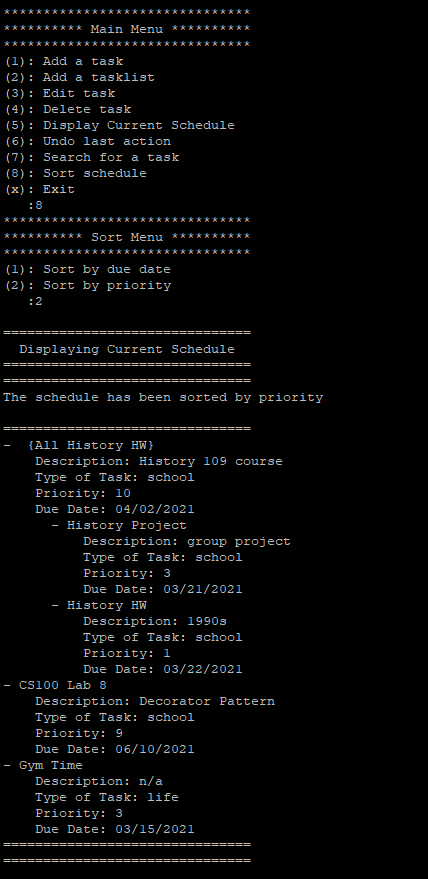
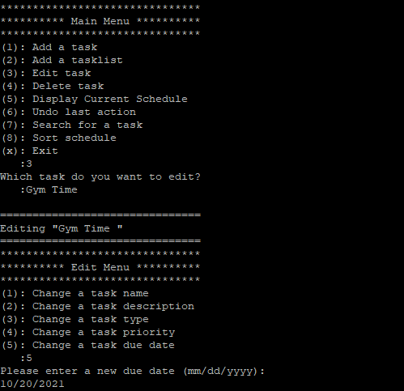
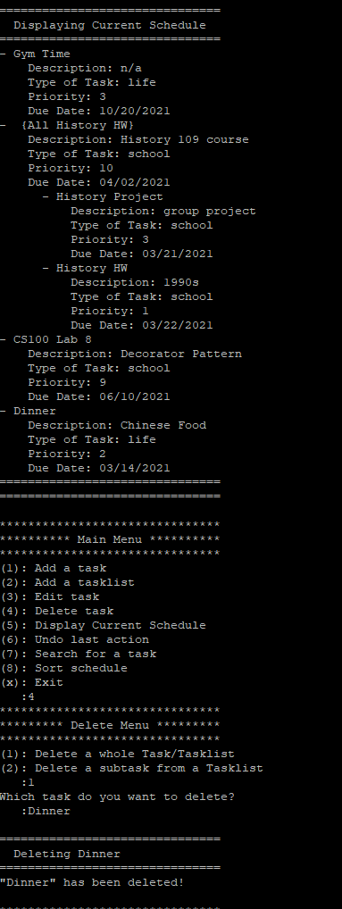
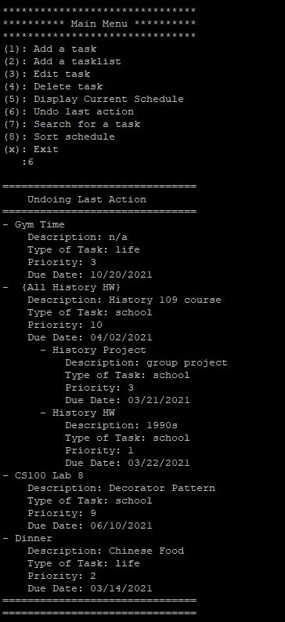
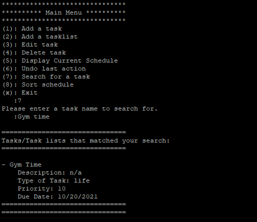

# CS 100 Final Project - Task Manager
#### Group Members: Michelle Chu, Huan Tran, James Ooi
#### Github Pages: https://github.com/meshellchoo, https://github.com/ethanotran, https://github.com/galacticgoob
#### Project Description: 
#### Motive
  - As college students, we find the task manager project important because we find it difficult to mange our time wisely. With the surge of online classes, many classes use different websites to submit assignments, which makes it difficult to manage all the assignments. With the task manager, we can use a single platform to keep track of all of these assignments and also set the priority of these assignments to create an effective task list. Additionally, we can include our personal and work tasks too to make the most out of the application.
#### Languages/Tools/Technologies
  - We plan on using C++, git, Vim, C++ gui libraries, and PuTTY. 
#### Input/Output
  - The input of our project will be the task title, description, classification (similiar to a tag), priority, duration, and due date. Additionally, the user can create a task list and input the title, description, tasks, and priority of that task list.
  - Our project will have two outputs based on if the user decides to view a task or task list. If the user decides to view a task, it will output all the information about the task. If the user decides to view a task list, it will output a neatly arranged task list based on the added tasks' priority and due date.
#### Design Patterns
  - We picked the Composite Pattern because we think it will be useful for task and tasklist to share a common interface. The feature we will implement allows the user to add tasks or tasklists onto their task manager. By using composite, we avoid the problem of having a lot of classes in our code and allows the tasks to share a common interface. This design pattern allows us to treat primitive (task) and container (tasklist) types the same. With this design pattern, we can produce families of related objects (tasklist, task, etc.) without specifying the concrete class, task class.

  - We picked the Memento Pattern because we think it will be useful when trying to incorporate the undo function for the Task Feature and Task Lists Feature. The Memento Pattern allows us to create a "memento" object to store the current state of the "originator" object, thus allowing us to return to a previous state after committing to a change. Without this design pattern, the "memento" object would not be able to access private properties of the "originator" object. A problem we anticipate encountering when implementing the project is that the user can accidentally delete/edit a task or task list with no way of restoring them. With the Memento Pattern, they can undo the deletion/editting and bring back their previous task, task list, or task bank.

#### OMT Diagram

#### Class Diagram Description

  - The OMT Diagram depicts a Composite Design Pattern and the Memento Design Pattern. The Composite Pattern is implemented in the Task and TaskList classes as both classes redefine functions the TaskObject class has and are treated under the same level in the class hierachy. The TaskObject class uses protected member variables for taskName, description, taskType, priority, and dueDate so that the derived classes can use these member variables. Moreover, the TaskObject class has public functions for the setters and getters so the user can edit their tasks and task lists, and it has a bool function, "isTaskList()" so that the TaskBank knows if a task or task list is being inserted. Furthermore, we have created a class for Date so that the dueDate can be entered in DD/MM/YYYY format, and we have created a function "validDateFormat(std::string date)" to check if the user inputted date is valid. The TaskList Class has an additional private member variable, "std::vector<Task*> Tasks", and additional functions, "addTask(Task* task)", "deleteTask(Task* task)", "deleteTask(std::string task)", "sortByPriority()", "sortByDueDate()", "std::vector<Task*> getSubTasks()", and "clear()", which allows TaskList to represent a large task with subtasks.
  - The Memento Pattern is implemented using originator, memento, and command classes for the TaskBank. Going more in depth, the TaskBankMemento Class initializes a TaskBank object to make a copy of a previous state of a task bank. The TaskBankCommand class allows us to backup the previous states (TaskBankMementos) and revert back to that previous state. Ultimately, the TaskBankMemento class has a private member variable, "std::vector<TaskObject*> taskBank", which is takes in a vector of TaskObjects*. Any edits to a task, task list, or task bank such as deletion, insertion, or sorting can all be undone due to the implementation of the Memento Pattern. The relationship of the TaskBank taking in TaskObjects* a prime example of the Composite Pattern and Memento Pattern working together. Aside from the previously mentioned classes, we have created a TaskManager class that is basically a simple user interface. The TaskManager class uses additional helper functions, which are defined in the helperFunctions class, to carry out the addition, deletion, and sorting of tasks, etc. The user should only be able to access the run() function and be able to add tasks, delete tasks, sort tasks etc.

#### Screenshots of the Input/Output of Our Application
#### Main Menu:

#### Creating a New Task (Error Handling Shown):

#### Creating a New Task List (Error Handling Shown):

#### Sorting by Due Date

#### Sorting by Priority

#### Editing an Existing Task

#### Deleting a Task

#### Undo-ing Last Action 

#### Searching For A Task

####  Installation Guide:
1. Clone this GitHub Repository on your local terminal (preferably PuTTy). You can get the link by pressing the green button named "Code".
2. Edit the #includes in the files in src/ and tests/ folders. 
3. Run "cmake3 ." then "make" on the command line.
4. Run "./TaskManager" on the command line.
5. Enjoy your new task manager!

#### How This Project Was Tested:
1. Unit Tests were created to test the functions in the TaskObject class.
2. Unit Tests were created to test the functions in the Task class.
3. Unit Tests were created to test the functions in the TaskList class.
4. Unit Tests were created to test the functions in the TaskBank class.
5. Unit Tests were created to test possible invalid inputs for each class' functions.
6. A main.cpp was created to test the interface and the helper functions.
7. Valgrind was used to check for memory leaks in the unit test, main.cpp, and the program itself.

